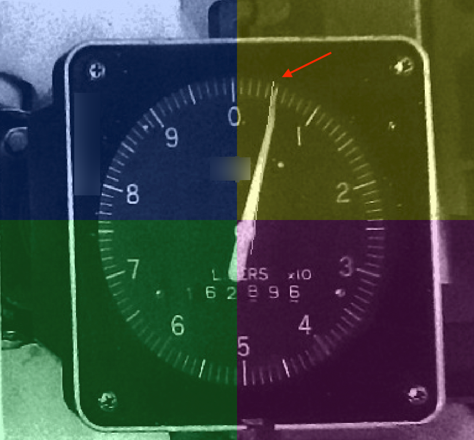

# Overview

This application uses [OpenMV H7 Plus](https://openmv.io/products/openmv-cam-h7-plus) to read the measurement of an analogue rotary flow meter (pointer type) and remotely transmit to a server via MQTT using an ESP8266.

The repo is structured in two folders as follows.

## flow_meter_reader 
This is the micropython code to be run on the OpenMV IDE. The output is the angle and flow output of the indicated by needle. The `README` on that folder includes the details.

## remote
The code in this folder performs the analogue reading as above, and additionally uses an ESP8266 to communicate with OpenMV over UART, execute a remote procedure, get the flow meter's output, and transmit via MQTT to an MQTT server.
The flow reading code is a functionalised and optimised version of the code found in the `flow_meter_reader` folder with minimal comments, and the content of the python file should be added as a `main.py` in the root of the OpenMV camera.

The arduino `ino` sketch needs to updated to include the MQTT broker IP, MQTT topic and WiFi credentials.

# The flow meter and testing setup
Below is an image of the flow meter used in this project. Details have been erased for anonymity.


Test is done by using the live H7 Pro camera with a telephoto lens and printed copies of the flow meter photo in actual size of the flow meter, in a set up that looks like the below.  


The camera is installed on a fixed position towards the flowmeter, and therefore the ROI (Region of Interest) of the screen and center as well as perspective and rotation correction parameters can be safely set.

# Set up OpenMV
On a new H7:

- If required, clean the lens and focus according to the docs

- Use an SD card, formatted in exfat or FAT, and copy the contents of the modules flash (which appear as a USB drive on the PC/Mac). The contents are a main.py (the micropython code) and a README file.

- Install the IDE, connect via USB and run the Hello World start app.

# Process
## Step 1 - find lines
In the first approach, we will attempt to identify the lines of the flow meters, with the goal of identifying the angle of the pointer, and map that to the 0 - 100 point output.

We will do this using the [_find\_lines_](https://docs.openmv.io/library/omv.image.html#image.image.Image.image.find_lines) method of openMV. This method is using the [Hough Transformation](https://opencv-python-tutroals.readthedocs.io/en/latest/py_tutorials/py_imgproc/py_houghlines/py_houghlines.html) to detect lines.

What we care about from the output of the `find_lines` method, is the _theta_. Theta (0 <= θ <180) is defined as 

> the angle formed by this perpendicular line and horizontal axis measured in counter-clockwise


Note that the origin is the [upper left](https://blogs.mathworks.com/steve/2006/10/19/hough-transform-coordinate-system/) corner of the frame, and the x-axis goes from left to right, and the y-axis from top to bottom.

### Result

Let's run this method while pointing the camera towards an A4 print of the flow meter.

Prior to `find_line` we also apply some gamma and brightness correction along with sharpening so get some clearer results.

Also we have set the ROI to be within the flowmeter so as to avoid noise from the surroundings.

Finally we have set the frame size to a large one for convenience, and converted to grayscale to make up for performance loss due to increased size.


Note the parallel line along the pointer of the flow meter plotted by OpenMV. Let’s see the output of the find_lines method:

```
{"x1":369, "y1":156, "x2":301, "y2":408, "length":261, "magnitude":3179, "theta":15, "rho":395}
FPS 5.922165
```
Let’s skip all parameters except for `theta=15` and see what that means, according to the definition shared above:


-   In red are the axes

-   In green is a line parallel to the one drawn by OpenMV for better visibility

-   In blue is the perpendicular line from the origin towards the target line

-   In pink we see the *theta* of the Hough transformation.

-   In brown is the 90°-15°=75° on the more intuitive cartesian coordinate system.

Let's try some additional verifications of the above, via the arc tangent using the `[x, y]` of its start and end points. From the output above we know that `"x1":369, "y1":156, "x2":301, "y2":408`, and passing it through the code in Appendix 1, we get `74.8989`, very close to our cartesian finding above.

One would think that we can map the angles to the values of the flowmeter via a linear relationship. But, how do we know if the line corresponds to 0 or 100?

## Step 2 - Problem: finding pointer direction

By definition, the theta of the Hough transformation is between 0° and 179°. Which means it is not possible to detect direction (e.g. whether the pointer is 90° to the left - pointing at 2.5 of the flowmeter - or to the right, pointing and 7.5 of the flowmeter screen). The same would be the case with the arc.


Two ideas for tackling the direction issue:

We see that the needle of the gauge is longer on the pointing side. So, if we split the line in two, the amount of white pixels on the half of where the needs is pointing will be larger than the back of the needle. This should inform about the direction of the needle and line.

If we detect the line segment of the needle instead of infinite line, the longest part will fall on the quadrant that will inform of the direction.

The second idea sounds like less effort so will try that first.

### Line Segment Detection

Using the [*find_line_segments*](https://docs.openmv.io/library/omv.image.html#image.image.Image.image.find_line_segments "https://docs.openmv.io/library/omv.image.html#image.image.Image.image.find_line_segments") method with appropriate inputs, we get a result like the following, with the following output

```{"x1":410, "y1":155, "x2":380, "y2":306, "length":154, "magnitude":14, "theta":13, "rho":437}```


#### Detect direction using quadrants

Let's color each quadrant to illustrate the approach. In the image below:

-   Identify the long edge by finding point of the line that is the furthest away from the center of the ROI (in this case, the center of the square - for simplicity, we assume that the camera is placed so that the center of the flow meter is almost at the center of the frame). In this case, it's the point with the red arrow.

-   Use to `[x, y]` of that point to identify the quadrant in which it falls into. This will determine the direction.

-   Combine that with a mapping of the line's angle to the flow meter's output (0 - 1 or 0 - 100) we should be able to get the measurement. In the case of the image below, we want to know that the needle is pointing at 0.5 of Q1 and not at 5.5 of Q3.



#### Finding the center of the gauge

However, looking on the color coding above, we see that the center of the frame might not necessary be the center of the gauge, around with the needle evolves. What we if tried to detect the circle instead? That should give us the precise `[x, y]` of the gauge's center.

We can try to do this using the `find_circles` method, and restricting the ROI close to the frame's center as well as the appropriate Hough transform threshold for our application. The outcome is the following

```1{"x":384, "y":279, "r":8, "magnitude":6495}```


We see that with the correct parameters, the circle is very accurately detected and the [x, y] is now found.

We can now use this point to precisely identify the quadrants. Let’s see how that looks. The screenshot below is in color just so the different axes are emphasised. The plotting of the below is directly from the OpenMV


Having found the circle and therefore the center of the gauge, we should be able to approximate the needle measurement by drawing radial lines from the center outwards. Plotting a line for every 5 degrees would look like this:


Now let's combine the line of the needle with the center in the following way;

1.  Using the line identified on the Line Segment Detection section, get the point of the line that is furthest away from the center (i.e where the needle is pointing). This should dictate the direction (without the need to look at quadrants).

2.  Draw a line using that point and the center of the circle
3.  Get the angle and map it to the output of the gauge

## Step 3 - finding the angle

Let’s draw some arrows using the points of the line segment and the center. In the images below we also keep the original line in white for reference.

We paint red the line that is created using the center and [x1, y1], and blue the line between the center and the [x2, y2].


What if the needle if the line was pointing at 55 instead of 5? Below we have just flipped the print in lieu of a real photo with the needle to that direction. Later we will try various angle using edited photos.


We should therefore be able to get the correct line, and therefore its direction, by looking on the longest one. Let’s how this looks:


Then, we calculate the arctangent to get the angle. For a more intuitive approach, we will map output of 0 to 0/360 degrees, output of 25 to 90 degrees and so on (therefore a factor of `0.277`), and move clockwise instead of counter-clockwise. Doing so, means that on the that Q4 (top-left on clockwise) will give a negative angle, so we will just subtract it from 360.

Below we are just rotating the piece of paper:
| Q1 | Q2 |  Q3 |  Q4 |   |
|---|---|---|---|---|
|   |   |   |   |   |
| `angle: 11, output: 3.047` | `angle: 105, output: 29.085`  |  `angle: 191, output: 52.907` | `angle: 281, output: 77.837` |   |

There is clearly as deviation that is likely due - among others:

-   The quality of the photograph (notice how the thin top of the needle is distorted towards the right)

-   Perspective correction (will be explored separately later, but it can always play a role)

-   The environmental conditions (lighting, camera focus, etc.)

-   The line detection algorithm itself

For example, the obvious mistake here was the rotation, because we assumed that the zero measurement is on a vertical axis, where it is obviously not (screenshot below directly from OpenmV):

 

So, we can either ensure 0 falls on the vertical axis, or detect it otherwise. Let's see below.

For all points above there can be techniques for optimisation that can be part of separate experiments.

## Step 5 - Live detection

Live rotating needle with corrected rotation.

Let’s put it all of the above together, and correcting the rotation issue so that 0 falls on the vertical axis. 

Additionally, since we do not have a real flow meter for testing, let’s do some paper cutting to simulate the needle (after drawing over the printed one with pencil so it’s not visible after the color correction).

The (unedited) screencast below is the result, which is is fact rather accurate. Click pause when readings are shown to verify them.

Screencast:

 

The left-hand side is not always giving results due to inaccurate ROI during calibration. Also note that the printout is just an A4 paper with the needle being pushed from the back side, so some distortion in perspective as well as movement is added, that results in less accurate calculations.

## Step 6 - Perspective and rotation correction

Assuming the camera is not installed on a perpendicular plane, it’s likely that we will need to do rotation and/or perspective correction as a calibration step, prior to reading the needle. 

### Perspective correction 

Let’s start with perspective correction by looking at the example below.

| How the printout is place against the camera  | How the camera sees it in OpenMV   |
|---|---|
|    |     |

Using the `rotation_corr` method and specifically the `corners` parameter, we define how each corner (starting top-left and moving clock-wise) need to move to adjust to the preferred correction, in order to achieve a circular screen for the flow meter instead of an ellipse. We can identify this using the ROI on the Frame Buffer, and figuring out the amount of pixels for each corner. For example, knowing that the flow meter is square, we will try to fix perspective accordingly:


With some trial and error we identify the proper value for this resolution (VGA) and target placement, 

```
TARGET_POINTS = [(0,   0),   
                 (w-200, 75),  
                 (w-100, h+90), 
                 (40,   h-20)] 
```

with the result being:


Now we have the screen being a circle, however 0 and 5 are not on the vertical axis:


Let’s fix that by rotating along the z axis. We can find the angle either using ApriTags or by trial and error. In our case and angle of 1.5 degrees is sufficient:


We can now combing AprilTags, perspective and rotation correcting in a calibration file.

# References
Hough Transform:

-   [OpenCV Hough Line Transform](https://docs.opencv.org/3.4/d3/de6/tutorial_js_houghlines.html "https://docs.opencv.org/3.4/d3/de6/tutorial_js_houghlines.html")

-   [MathWorks Hough transform](https://www.mathworks.com/help/images/ref/hough.html#:~:text=theta%20is%20the%20angle%20of,to%20the%20positive%20x%2Daxis. "https://www.mathworks.com/help/images/ref/hough.html#:~:text=theta%20is%20the%20angle%20of,to%20the%20positive%20x%2Daxis.")

-   [Hough transform coordinate system](https://blogs.mathworks.com/steve/2006/10/19/hough-transform-coordinate-system/ "https://blogs.mathworks.com/steve/2006/10/19/hough-transform-coordinate-system/")

# Appendix
Arc tangent in python:

```            
dy = l.y1() - l.y2()
dx = l.x1() - l.x2()
th = math.atan2(dy, dx)
th *= 180/math.pi           
print(th)
```